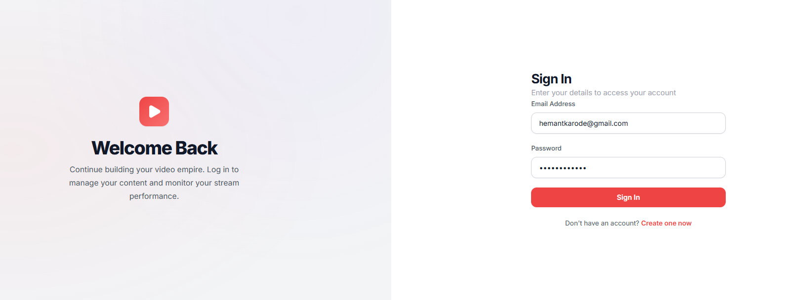
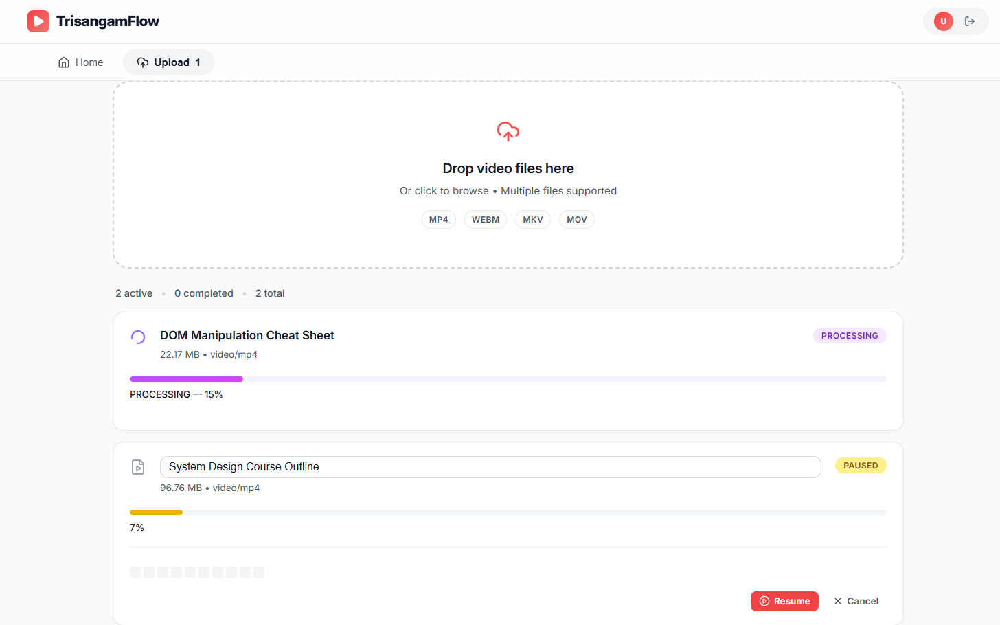
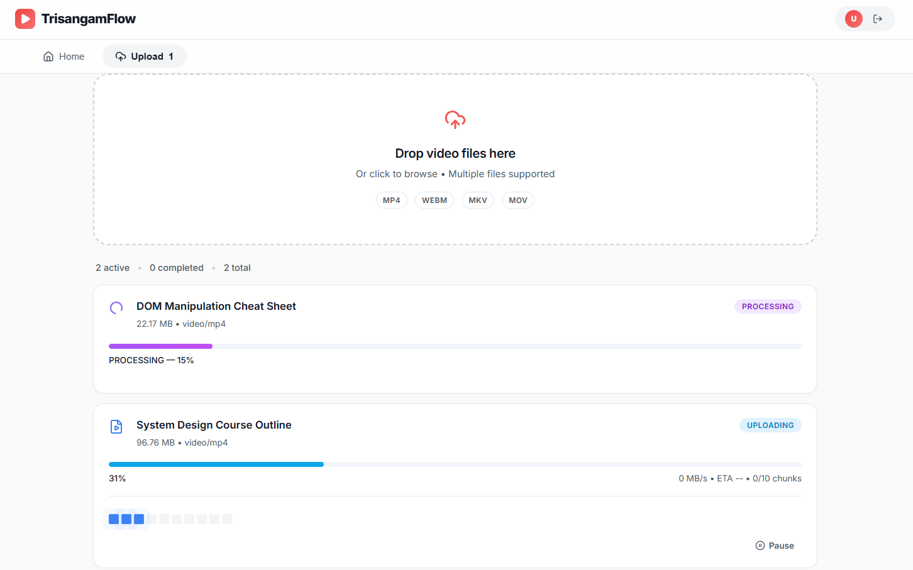
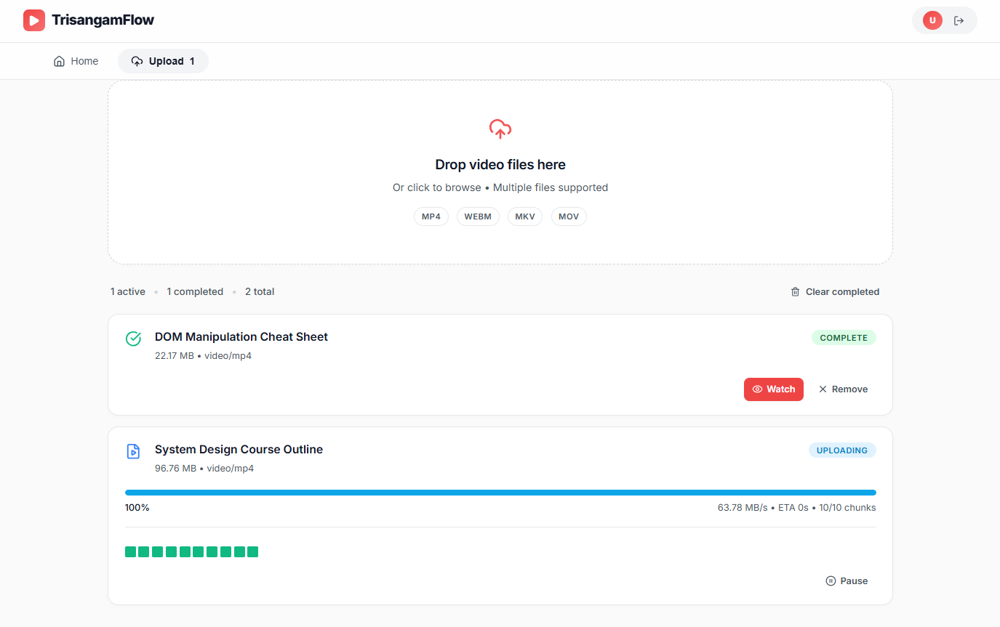
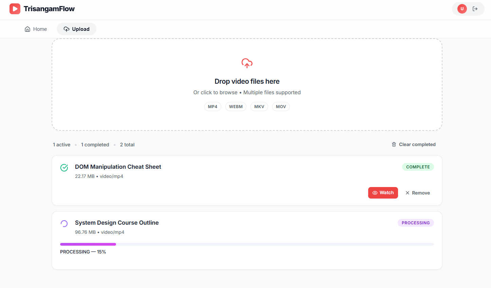
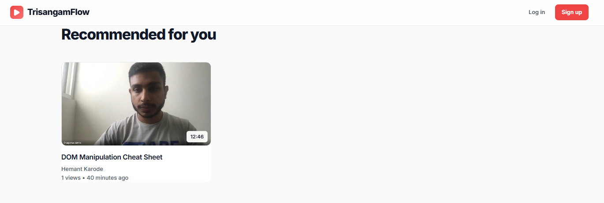
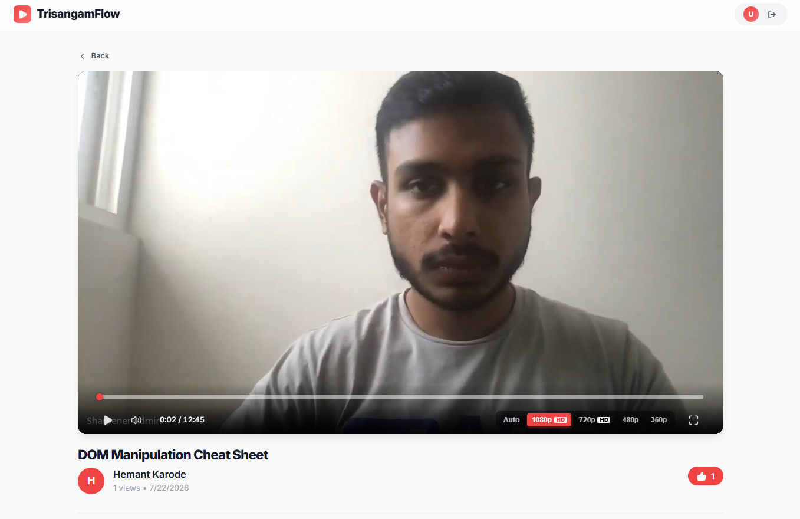
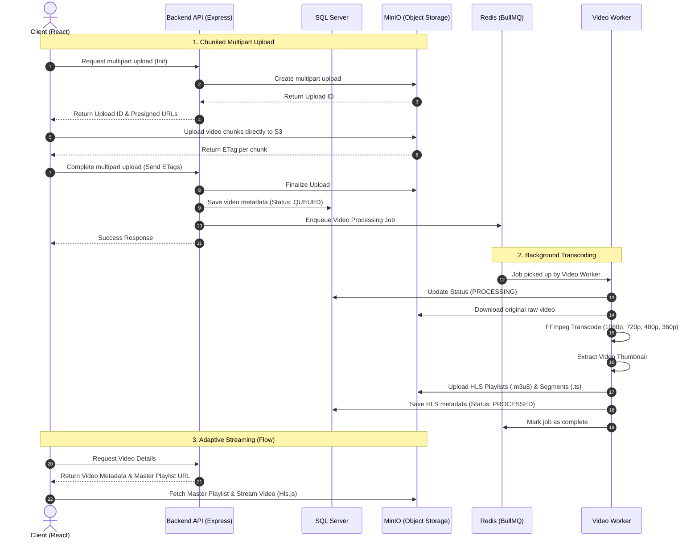

# TrisangamFlow (YouTube Streaming Clone)

TrisangamFlow is a production-grade, end-to-end video streaming platform built with a modern tech stack. It features chunked multipart video uploads directly to S3/MinIO, background FFmpeg processing for adaptive bitrate HLS streaming, and a beautiful React frontend.

---

## 📸 Screenshots

| 1: Authentication | 2: Resumable Uploads(Pause/Resume) |
| :---: | :---: |
|  |  |
| **3: Chunk Uploading** | **4: Transcoding Job** |
|  |  |
| **5: Upload Complete** | **6: Home Feed** |
|  |  |
| **7: Adaptive Video Player** | |
|  | |

---

## 🌊 Why TrisangamFlow?

TrisangamFlow is inspired by the concept of *Trisangam*, which symbolizes the confluence of three streams. In my platform, those three streams are the three core stages of the video pipeline:

1. **Upload** – The user securely uploads a video using multipart chunking.
2. **Transcode** – The platform automatically converts it into multiple resolutions (e.g., 360p, 480p, 720p, 1080p) via FFmpeg.
3. **Flow** – The processed video is delivered to users through adaptive streaming directly from blob storage.

---

## 🏗️ Architecture & Flow Diagram

The following diagram illustrates the complete end-to-end data flow when a user uploads and watches a video.



---

## 🚀 Tech Stack

- **Frontend**: React (Vite), React Router, Hls.js, Vanilla CSS, Lucide Icons
- **Backend**: Node.js, Express.js
- **Database**: Microsoft SQL Server (Raw SQL via `mssql` — No ORMs)
- **Message Queue**: Redis & BullMQ (for background processing)
- **Object Storage**: MinIO (S3 Compatible)
- **Video Processing**: FFmpeg (HLS Transcoding)
- **Containerization**: Docker Compose

---

## ⚙️ Step-by-Step Setup Guide

Follow these exact steps to set up and run the platform on your local machine.

### Prerequisites
Before you start, make sure you have the following installed:
- **Git** (to clone the repo)
- **Node.js** (v20 or v22+ recommended)
- **Docker Desktop** (required to run SQL Server, Redis, and MinIO locally)

### 1. Clone the Repository
Open a terminal and clone the repository to your machine:
```bash
git clone <YOUR_GITHUB_REPO_URL>
cd TrisangamFlow-Video-Streaming-Platform
```

### 2. Configure Environment Variables
You need to create two `.env` files to configure the databases, storage, and application ports.

**A. Root Directory (Docker)**
Create a `.env` file directly in the root folder (`TrisangamFlow-Video-Streaming-Platform/.env`) and add these credentials:
```env
MSSQL_SA_PASSWORD=YourStrong@Passw0rd
MINIO_ROOT_USER=minio
MINIO_ROOT_PASSWORD=minio123
```

**B. Backend Directory (Node.js)**
Navigate to the `backend/` folder and create another `.env` file there. Add the following:
```env
PORT=5000

DB_USER=sa
DB_PASSWORD=YourStrong@Passw0rd
DB_SERVER=localhost
DB_DATABASE=youtube_platform
DB_PORT=1433

JWT_ACCESS_SECRET=replace-with-long-secret
JWT_REFRESH_SECRET=replace-with-long-secret
JWT_ACCESS_EXPIRES_IN=15m
JWT_REFRESH_EXPIRES_IN=30d

MINIO_ENDPOINT=localhost
MINIO_PORT=9000
MINIO_ACCESS_KEY=minio
MINIO_SECRET_KEY=minio123
MINIO_BUCKET=videos
MINIO_USE_SSL=false

REDIS_HOST=localhost
REDIS_PORT=6379
```
*(Make sure `DB_PASSWORD` matches `MSSQL_SA_PASSWORD` and the MinIO keys match exactly as provided here).*

### 3. Start the Docker Infrastructure
From the root folder (`TrisangamFlow-Video-Streaming-Platform`), start up SQL Server, Redis, and MinIO in the background:
```bash
docker-compose up -d
```
> **Tip:** Wait about 10-15 seconds after running this command to allow the SQL Server database engine to fully start before moving to the next step.

### 4. Setup and Run the Backend
The backend is designed to automatically create the database, run migrations, and configure the S3/MinIO bucket.
```bash
cd backend
npm install
npm run dev
```
You should see output in your terminal indicating:
- `Database 'youtube_platform' created successfully`
- `SQL Server Connected`
- `Server running on port 5000`

### 5. Setup and Run the Frontend
Open a **new terminal window**, navigate to the frontend folder, and start the React application:
```bash
cd frontend
npm install
npm run dev
```

### 6. Access the Application!
You are all set! Open your browser and navigate to:
- **Frontend App:** http://localhost:5173 (or the port specified by Vite in the terminal)
- **Backend API:** http://localhost:5000
- **MinIO Storage Console:** http://localhost:9001 (Login using `minio` / `minio123`)

---

## 🛑 Shutting Down
To stop the background services and preserve your data, run this from the project root:
```bash
docker-compose down
```
*(Data is persisted in Docker volumes, so your videos and database won't be lost between restarts).*
